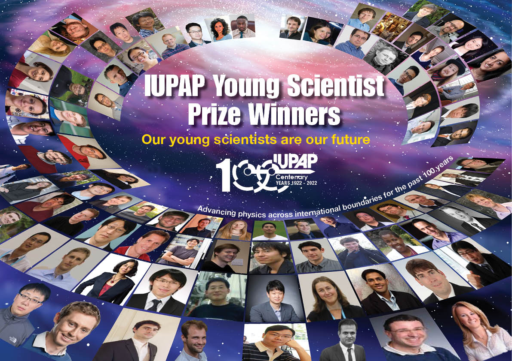

# ECSA 2023

The Commission on Computational Physics (C20) of IUPAP seeks nominations for its 2023 Early Career Scientist Award (previous Young Scientist Prize).
Procedures for making a nomination are found [here](https://iupap.org/awards/young-scientist-prizes/).
The deadline for nomination submissions is May 31st, 2023 (midnight UTC).

The 2023 Early Career Scientist Prize in Computational Physics will be awarded to Dr. Sinéad Griffin at Lawrence Berkeley National Laboratory.
The citation is: “For her significant achievements in computational materials physics, expanding our understanding of topological quantum materials and establishing new paradigms for dark matter detection.”

Also see
* [C20: News](https://iupap.org/who-we-are/internal-organization/commissions/c20-computational-physics/c20-news/)
* [2023 IUPAP Early Career Scientist Prize in Computational Physics](https://sites.google.com/view/grigraphene/announce/2023-C20-ECSP-Award)

