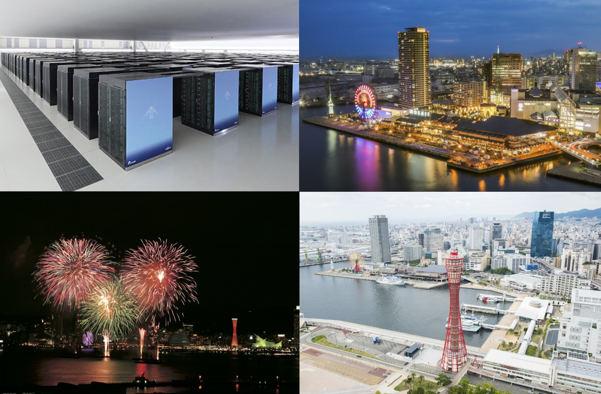

# CCP2023 - 34th IUPAP Conference on Computational Physics

* Date: August 4 (Fri) - 8 (Tue), 2023
* Venue: [Kobe International Conference Center](https://kobe-cc.jp/en/visitors/), Kobe Port Island, Kobe, Japan

CCP2023 is the 34th in a series of meetings of scientists working in the domain of Computational Physics. The Conference on Computational Physics (CCP) is held every year under the auspices of the C20 Commission for Computational Physics of the International Union of Pure and Applied Physics (IUPAP). The conference includes a broad range of computational scientists with common interests in communicating and engaging with their computation-oriented colleagues to exchange information and develop future collaborations.

Photos: © RIKEN and Kobe Tourism Bureau
