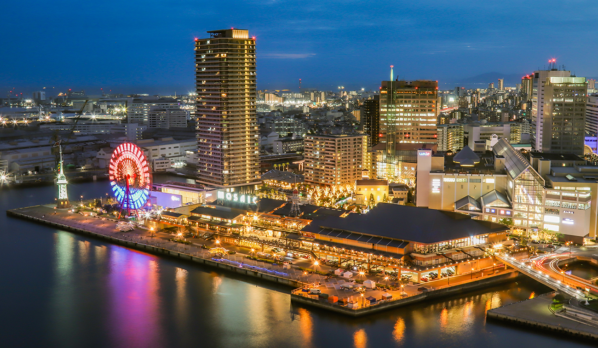

CCP2023 Group Photo (2023-08-06)

# CCP2023 - 34th IUPAP Conference on Computational Physics

### News

* [2023-08-05] [Information for on-site oral presentation](info-20230805.html)
* [2023-08-04] Program, Abstracts, Zoom Information can be found in the [Confit Program site](https://confit.atlas.jp/guide/event/ccp2023/top?lo=fin&eventCode=ccp2023) and the login information can be found in the e-mail sent to you from noreply.confit@atlas.jp at 11:27 on August 1, 2023.
* [2023-08-04] [Information for on-site poster presenters](info-20230804-2.html)
* [2023-08-04] [Information about WiFi connection in the venue](info-20230804.html)
* [2023-08-03] [Information just before CCP2023](info-20230803.html)
* [2023-07-18] [Tentative program](program.html#program-1) has been uploaded.
* [2023-05-22] [EPS travel/registration awards](registration.html#eps-travelregistration-awards-for-early-career-participants) are now available.
* [2023-04-25] [APS-DCOMP travel/registration awards](registration.html#aps-dcomp-travelregistration-awards-for-early-career-participants) are now available.

### CCP2023

* Date: August 4 (Fri) - 8 (Tue), 2023
* Venue: [Kobe International Conference Center](https://kobe-cc.jp/en/visitors/), Kobe Port Island, Kobe, Japan

CCP2023 is the 34th in a series of meetings of scientists working in the domain of Computational Physics. The Conference on Computational Physics (CCP) is held every year under the auspices of the [C20 Commission for Computational Physics](https://iupap.org/who-we-are/internal-organization/commissions/c20-computational-physics/) of the [International Union of Pure and Applied Physics (IUPAP)](assets/images/iupap100.pdf). The conference includes a broad range of computational scientists with common interests in communicating and engaging with their computation-oriented colleagues to exchange information and develop future collaborations. We plan to hold CCP2023 in a hybrid way, namely, on-site and on-line (using an Internet conference system).

Supercomputer Fugaku at RIKEN R-CCS in Kobe (© RIKEN)

### [IUPAP Conference Policies](https://iupap.org/conferences/conference-policies/)

CCP2023 will be conducted in accordance with principles of
the International Union of Pure and Applied Physics (IUPAP)
as stated in the IUPAP resolution passed by the General Assembly in 2008 and 2011. In particular, no bona fide scientist will be excluded from participation on the grounds of national origin, nationality, or political considerations unrelated to science. It is the policy of IUPAP that all participants in Union activities will enjoy an environment which encourages the free expression and exchange of scientific ideas, and is free from all forms of discrimination, harassment, and retaliation.

Kobe in the Twilight (©︎ Kobe Tourism Bureau
