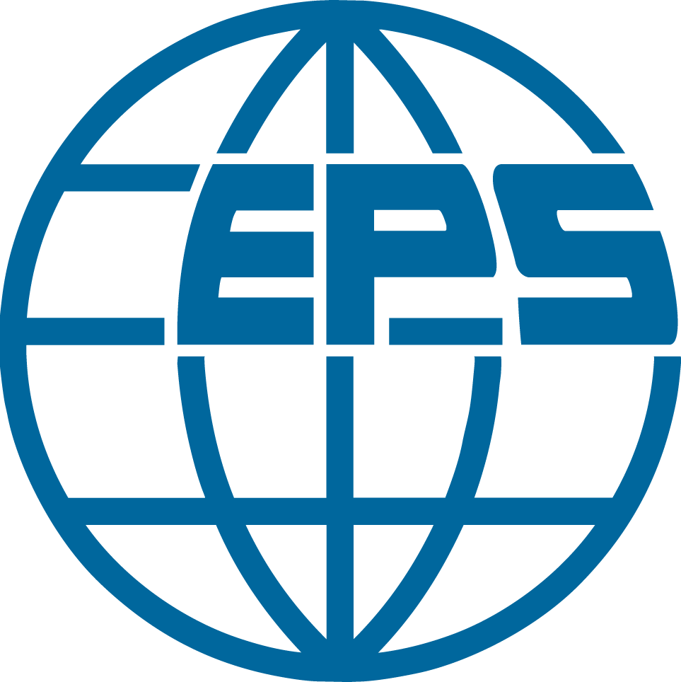

# Presentation Prizes

A small number of outstanding presentations will be honored by prizes. So far, the following prize is confirmed to be given.

### Taylor & Francis Molecular Simulation Prize

sponsored by the journal Molecular Simulation
published by Taylor & Francis

### EPS Poster Prize

sponsored by EPS. A prize of 200 Euros will be given to one Ph.D. student who gave the best poster presentation and who prepared the poster by themselves.

