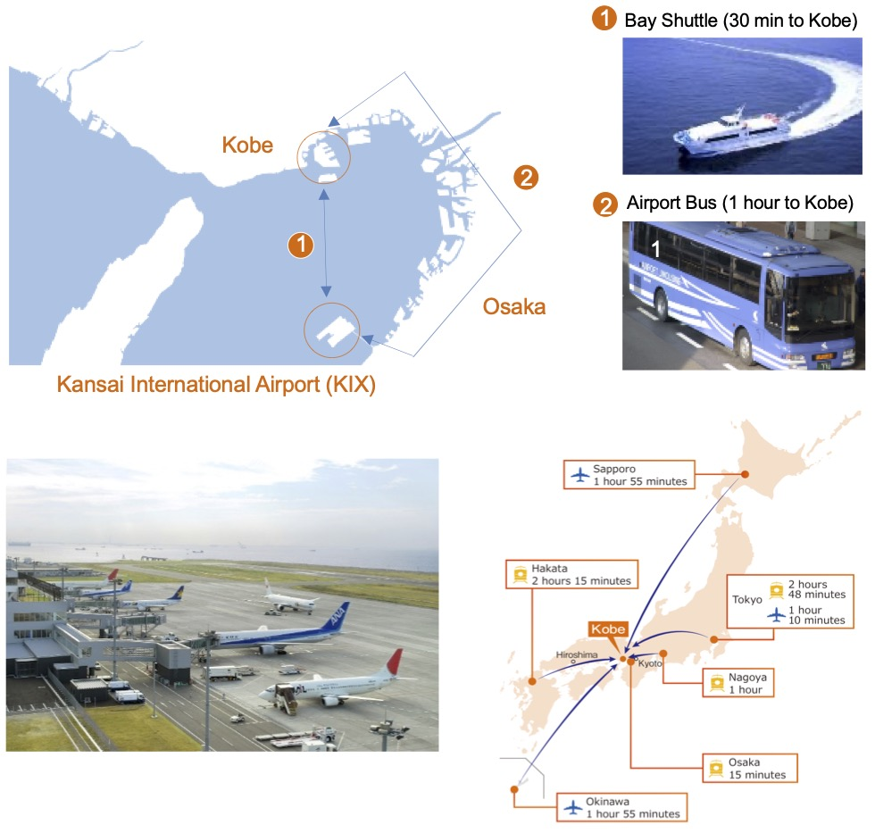

# Travel Information

Kobe [https://www.feel-kobe.jp/en/](https://www.feel-kobe.jp/en/)  
is a beautiful port city with population of 1.5 million in the Kansai Region of Japan. It was a capital of Japan for a very short period (around 1,180 AD), and so you can enjoy both old and modern parts of Kobe. It is famous for Kobe beef and Sake (of Nada Area). 

## Transportation

Although Kobe has a small airport (Kobe Airport - offering flights from 10 cities in Japan), it is more convenient to use the Kansai International Airport, the nearest major international airport from Kobe. If you ride a high-speed ferry, you can reach Kobe in 30 minutes from the Kansai International Airport. Tokyo is about one-hour away by plane, and it takes Shinkansen, or bullet train, about 2 hours and 45 minutes to go from Tokyo Station to Shin-Kobe Station.

## Climate

The summer in Kobe is very hot and humid. But staying in the buildings with air conditioning is comfortable. You could enjoy visiting the Rokko Mountain Range or Suma Beach nearby to cool off.

## Accommodation

* [http://www.feel-kobe.jp/en/facilities/accommodation/](http://www.feel-kobe.jp/en/facilities/accommodation/)

There are three hotels in the 3 to 5-star range within a 5 minutes-walk of the conference venue. Combined they offer almost 1,250 rooms. In downtown Kobe (10-20 minutes from the Conference Venue) there are 8,000 rooms spread over 50 hotels. 

### Hotels in the immediate vicinity of the Conference Venue

* [Kobe Portopia Hotel, just next to the Conference Venue [746 rooms/19,000 yen -]](https://www.portopia.co.jp/en/)
* [Hotel Pearl City Kobe [381 rooms/12,000 yen -]](https://www.pearlcity.jp/kobe/en/)
* [Ariston Hotel Kobe, just next to the Conference Venue [121 rooms/10,000 yen -]](https://www.ariston.jp/kobe/en/)

### Hotels in downtown Kobe

* [Hotel Monterey Kobe [164 rooms/12,000 yen -]](https://www.hotelmonterey.co.jp/en/kobe/)
* [Kobe Sannomiya Tokyu Rei Hotel [235 rooms/11,000 yen -]](https://www.tokyuhotelsjapan.com/global/kobesannomiya-r/)
* [Kobe Motomachi Tokyu Rei Hotel [191 rooms/11,000 yen -]](https://www.tokyuhotelsjapan.com/global/kobemotomachi-r/)
* [Remm+ Kobe Sannomiya [209 rooms/10,000 yen -]](https://www.hankyu-hotel.com/hotel/remm/kobe-sannomiya#)
* [Apa Hotel Kobe Sannomiya [202 rooms/9,000 yen -]](https://www.apahotel.com/hotel/kansai/hyogo/kobesannomiya/)
* [the b' Kobe [168 rooms/9,000 yen -]](https://www.theb-hotels.com/en/theb/kobe/)
* [Hotel Via Mare Kobe [95 rooms/9,000 yen -]](https://www.h-viamare.co.jp)
* [Hotel Kitano Plaza Rokkoso [49 rooms/8,500 yen -]](https://www.rokkoso.com/?men=6)

### Budget hotels in downtown Kobe

* [Toyoko Inn Kobe Sannomiya No. 1 [134 rooms/7,000 yen -]](https://www.toyoko-inn.com/eng/search/detail/00074)
* [Toyoko Inn Kobe Sannomiya No. 2 [335 rooms/7,000 yen -]](https://www.toyoko-inn.com/eng/search/detail/00123)
* [Toyoko Inn Kobe Sannomiya-eki Shiyakusho Mae [157 rooms/7,000 yen -]](https://www.toyoko-inn.com/eng/search/detail/00304)
* [Hotel 1-2-3 [104 rooms/6,000 yen -]](http://www.hotel123.co.jp)
* [Super Hotel Kobe [87 rooms/6,000 yen-]](https://www.superhoteljapan.com/en/s-hotels/kobe/)
* [R&B Hotel Kobe [176 rooms/6,000 yen -]](http://randb.jp/en/kobe/)

### Luxury hotels

* [Kobe Kitano Hotel [30 rooms/40,000 yen -]](https://www.kobe-kitanohotel.co.jp/en/)
* [La Suite Kobe [70 rooms/35,000 yen -]](https://www.l-s.jp/)
* [Hotel Okura Kobe [475 rooms/27,000 yen -]](https://www.okura-nikko.com/japan/kobe/hotel-okura-kobe/)
* [Oriental Hotel [116 rooms/25,000 yen -]](https://www.orientalhotel.jp)
* [ANA Crown Plaza Hotel Kobe [593 rooms/20,000 yen -]](https://www.anacrowneplaza-kobe.jp/en/)
* [Kobe Minato Onsen Ren [90 rooms/20,000 yen -]](https://ren-onsen.jp)
* [Kobe Meriken Park Oriental Hotel [323 rooms/15,000 yen -]](https://www.kobe-orientalhotel.co.jp/english/)

Note: Room rates may change by 2023.

## Restaurants

### Near the Conference Venue

* [https://kobe-cc.jp/en/visitors/local-area-guide/](https://kobe-cc.jp/en/visitors/local-area-guide/) 
 [L: 700 yen - 5,000 yen; D: 1,500 yen - 20,000 yen] 
* Some examples are:
   * [Udon No Kotonoha (Udon noodles) [900 yen -]](https://tabelog.com/hyogo/A2801/A280104/28007285/)
   * [Kobesankan (Chinese) [1000 yen -]](https://gurunavi.com/en/kd79800/rst/)
   * [Casual Lounge Cocoro (Okonomiyaki) [1000 yen -]](http://sp.raqmo.com/cocolo/)
   * [Gyutaro (Korean BBQ) [800 yen -]](https://tabelog.com/hyogo/A2801/A280104/28004705/)
   * [Chiriken (Chinese) [800 yen -]](https://tabelog.com/hyogo/A2801/A280104/28049018/)
   * [Konishi (Yakitori) [700 yen -]](https://tabelog.com/hyogo/A2801/A280104/28003350/)
   * [Marina Square (Casual Western Food) [800 yen -]](https://tabelog.com/hyogo/A2801/A280104/28015317/)
   * [Restaurants in Port Pia Hotel [about 2500 yen -]](https://www.portopia.co.jp/en/restaurant/)
   * [Restaurants in Hotel Pearl City [about 2000 yen -]](https://www.pearlcity.jp/kobe/en/restaurants/)
   * [Restaurant in Ariston Hotel (Trattoria Terrazza) [1300 yen -]](https://www.ariston.jp/kobe/en/restaurant/)
   * [Etranges (Italian) [700 yen -]](https://etrangers-kobe.business.site)

   * [Minatoan En (Casual Japanese) [800 yen -]](https://tabelog.com/hyogo/A2801/A280104/28049083/)
   * [Kazokutei (Japanese Noodle) [600 yen -]](https://kazokutei.co.jp/port-island/menu/?store_id=port-island&doing_wp_cron=1667278945.0028700828552246093750)

###  Downtown Kobe

* Kobe beef
   * [Kobe Plaisir [15,000 yen -]](https://kobe-plaisir.jp/english/)
   * [Steak Land Kobekan [L: 3,000 yen -; D: 10,000 yen -]](https://steakland-kobe.jp/publics/translation/en/22/?url=publics/index/22/)
   * [Kawamura Sannomiya Flagship Restaurant [L: 3,500 yen -; D: 7,500 yen -]](https://www.bifteck.co.jp/en/)
   * [Wakkoqu [L: 6,000 yen -; D: 10,000 yen -]](http://www.wakkoqu.com/english/index.html)
   * [The Original Teppanyaki Steak Misono Kobe [L: 6,000 yen -; D: 10,000 yen -]](https://misono.org/en/)
* Izakaya (Japanese style pub) 
   * [Hyogo Gokoku World [3,000 yen -]](https://www.world-one-group.co.jp/brand_detail/hyogo/)
   * [Syushi Ozeki [3,000 yen -]](https://robatanoganso-ozeki.owst.jp/en/)
   * [Sakana Ekimae [3,000 yen -]](https://sakanaekimae.owst.jp/en/)
   * [Gohanya Isshin [4,000 yen -]](http://foodgate.net/shop/isshin.html?shop=isshin_kobe)
   * [Kaisenizakaya Kairyu [3,000 yen -]](https://tabelog.com/hyogo/A2801/A280101/28002770/)
* Ramen
   * [Metro Ramen [850 yen -]](https://tabelog.com/hyogo/A2801/A280101/28054153/)
   * [Daiichi Asahi Sannomiya [700 yen -]](https://asahi-foods.co.jp)
   * [Moccos [700 yen -]](https://www.moccos.jp/)
* Chinese
   * [Kobe Motomachi Bekkan Botanen [5,000 yen -]](https://www.botanen.jp/)
   * [Liang You [3,000 yen -]](http://www.ryoyu-shuke.com/CMLiangYou/)
   * [Nanjing District (Chinatown)](https://www.nankinmachi.or.jp)
* Halal
   * [Hyogo Halal restaurant [1,000 yen -]](https://tabelog.com/hyogo/A2801/A280103/28051394/)
   * [Ali’s Halal Kitchen [1,000 yen -]](https://tabelog.com/hyogo/A2801/A280101/28047078/)
   * [NAAN INN [1,500 yen -]](https://tabelog.com/hyogo/A2801/A280101/28000464/)

## Post Conference Activities

Kobe is very close to Osaka, Nara, and Kyoto, three major tourist places in the Kansai Region. From Sannomiya Railway Station in Kobe, it takes a local train about 30 minutes to Osaka, about 80 minutes to Nara, and about 80 minutes to Kyoto. It is recommended to visit at least one of the three cities after the Conference.

* Osaka [https://osaka-info.jp/en/](https://osaka-info.jp/en/)
* Nara [https://www.visitnara.jp](https://www.visitnara.jp)
* Kyoto [https://kyoto.travel/en/](https://kyoto.travel/en/)

A day trip from Kobe to Himeji is also a possibility. It takes a local train about 30 minutes to go from Kobe to Himeji. The City has a beautiful original Samurai Castle. [https://www.himejicastle.jp/en/](https://www.himejicastle.jp/en/)
