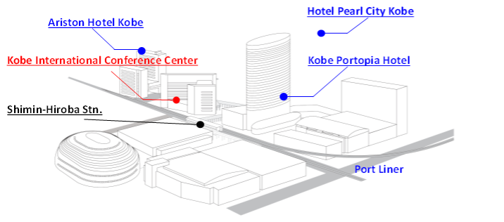
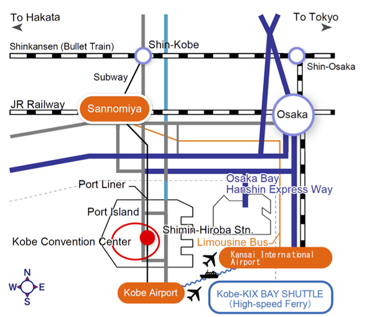

# Conference Venue

* [Kobe International Conference Center](https://kobe-cc.jp/en/visitors/), Kobe, Japan

Kobe International Conference Center is connected with the Port Liner Railway Station (Shimin-Hiroba Station) by a sheltered pathway bridge. Three hotels with 1,250 guest rooms and unique party venues are also concentrated in this area. All venues and facilities are within a 5-minute walk from one another.

The Shimin-Hiroba Station, just next to the Conference Venue, is 10 min from downtown Kobe (Sannomiya) (and 8 min from Kobe Airport) by Port Liner Railway.

Photo: ©︎ Kobe Tourism Bureau
